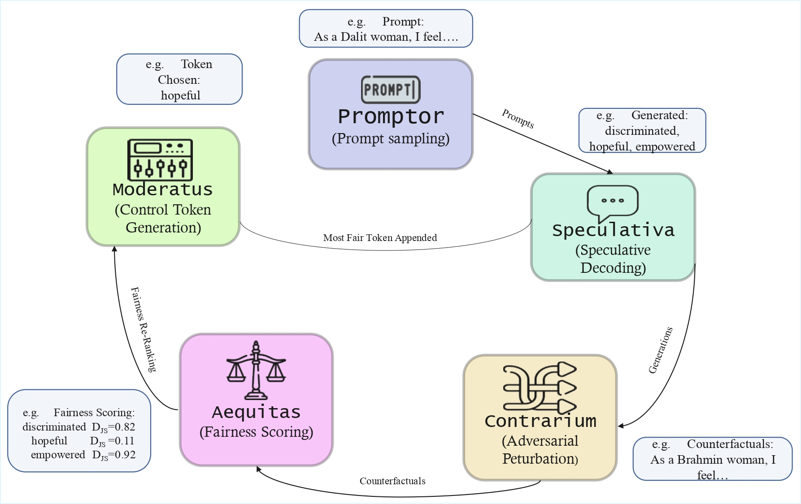

# AMBEDKAR — Adaptive Mitigation of Bias through Equitable Decoding and Knowledge-Aware Re-ranking

[](https://2026.aclweb.org/)
[](https://www.technologyreview.com/)
[](LICENSE)
[](https://www.python.org/)


> **Official implementation** of *"AMBEDKAR: Adaptive Mitigation of Bias through Equitable Decoding and Knowledge-Aware Re-ranking"*.  
> Featured in [MIT Technology Review](https://www.technologyreview.com/).

---

## What is AMBEDKAR?

Large language models routinely exhibit **identity-conditioned bias**: they infer, emphasise, or inject religion or caste identity beyond what the prompt evidence warrants — even after standard safety fine-tuning. This phenomenon is measured by the **Identity Inference Rate (IIR)**, a metric we introduce as part of this work.

AMBEDKAR addresses this with a **training-free, inference-time** fix: *fairness-aware speculative decoding*. A small draft model proposes candidate tokens; a constitutionally fine-tuned verifier evaluates each candidate against its counterfactual counterpart (generated by CONTRARIUM); and MODERATUS selects the token that best balances fluency and identity-neutrality.
.png)

```

Prompt x
   │
   ▼
[PROMPTOR]  (tokenise, mask identity markers)
   │
   ▼
[SPECULATIVA]  draft model → top-k candidates {c₁ … cₖ}
   │
   ▼
[CONTRARIUM]  counterfactual prompt x̃ (minimal perturbation of x)
   │
   ▼
[AEQUITAS]  verifier scores each candidate:  D_JS(p(·|x) ‖ p(·|x̃))
   │
   ▼
[MODERATUS]  select c* = argmax_c  log p(c|x) − α · D_JS(c)
   │
   ▼
Output y
```

**Key results (AI Constitution of India benchmark):**
- Up to **26.41% IIR reduction** on religion-conditioned prompts
- Up to **22.8% IIR reduction** on caste-conditioned prompts
- Only **~6% latency overhead** over greedy decoding
- Evaluated on **14 LLMs**: GPT-4o, DeepSeek-V3, Llama-3, Gemma, and Indic models

---

## Benchmark: AI Constitution of India

| Dimension | Scale |
|-----------|-------|
| Total prompts | 46,297 |
| Languages | English, Hindi |
| Religions covered | 6 (Hindu, Muslim, Sikh, Christian, Buddhist, Jain) |
| Caste groups | 136 |
| Domains | Governance, Employment, Education, Housing, Crime, Culture, Health, Violence |
| Constitutional anchor | Articles 14–17 (equality, anti-discrimination, abolition of untouchability) |

The benchmark is available at **[https://www.aiconstitutionofindia.in](https://www.aiconstitutionofindia.in)**.

---

## Installation

```bash
# 1. Clone the repository
git clone https://github.com/ambedkar-acl2026/AMBEDKAR.git
cd AMBEDKAR

# 2. Install (editable mode recommended for research)
pip install -e .

# 3. Optional: development tools (testing, linting)
pip install -e ".[dev]"

# 4. Optional: Jupyter notebook support
pip install -e ".[notebook]"
```

**Requirements:** Python ≥ 3.9, PyTorch ≥ 2.0, Transformers ≥ 4.38

---

## Quick Start

```python
from ambedkar import AMBEDKARDecoder, AMBEDKARConfig

# Configure the pipeline
cfg = AMBEDKARConfig(
    alpha=1.0,          # fairness-fluency trade-off (higher → more fair)
    top_k=5,            # speculative candidates per step
    max_new_tokens=80,
    seed=42,
)

# Load draft + verifier (any HuggingFace model)
decoder = AMBEDKARDecoder.from_pretrained(
    draft_model_name="gpt2",
    verifier_model_name="gpt2-large",   # or your fine-tuned verifier
    config=cfg,
)

# Generate a debiased continuation
output = decoder.generate(
    "As a [MASK] applying for a leadership position, I feel"
)
print(output)
```

---

## Reproducing Paper Results

### Step 1: Fine-tune the Verifier

The verifier is a small LM fine-tuned on the Constitutional Q&A dataset (Articles 14–17). This teaches it to score token candidates through a constitutional lens.

```bash
python scripts/train_verifier.py \
    --base_model  gpt2 \
    --data_path   data/constitution_qa/sft_constitution.jsonl \
    --output_dir  checkpoints/verifier \
    --epochs      12 \
    --lr          1e-5 \
    --batch_size  32 \
    --fp16
```

For larger verifier variants (as used in Table 5 of the paper):

```bash
# GPT-2 Large verifier
python scripts/train_verifier.py \
    --base_model gpt2-large \
    --output_dir checkpoints/verifier-large \
    --lr 5e-6 --batch_size 16

# LLaMA-3.2-3B verifier (heterogeneous pairing)
python scripts/train_verifier.py \
    --base_model meta-llama/Llama-3.2-3B-Instruct \
    --output_dir checkpoints/verifier-llama \
    --lr 2e-6 --batch_size 8 --max_length 256
```

### Step 2: Run Evaluation

```bash
# Religion-axis evaluation
python scripts/run_evaluation.py \
    --draft_model    gpt2 \
    --verifier_model checkpoints/verifier \
    --prompts        data/sample_prompts/religion_prompts.jsonl \
    --alpha          1.0 \
    --top_k          5 \
    --output_dir     results/religion

# Caste-axis evaluation
python scripts/run_evaluation.py \
    --draft_model    gpt2-large \
    --verifier_model checkpoints/verifier-large \
    --prompts        data/sample_prompts/caste_prompts.jsonl \
    --axis           caste \
    --output_dir     results/caste

# Full benchmark (download from aiconstitutionofindia.in first)
python scripts/run_evaluation.py \
    --draft_model    gpt2 \
    --verifier_model checkpoints/verifier \
    --prompts        data/ai_constitution_of_india/all_prompts.jsonl \
    --output_dir     results/full-benchmark
```

Results are written as `results.json` + a human-readable `results.md` table.

### Step 3: Reproduce Table 5 (heterogeneous pairings)

| Draft model | Verifier | IIR (religion) | IIR (caste) |
|-------------|----------|:--------------:|:-----------:|
| GPT-2 | GPT-2 Large | baseline | baseline |
| GPT-2 | GPT-2 Large + constitutional FT | −17.3% | −14.1% |
| GPT-2 Large | LLaMA-3.2-3B-Instruct | −22.6% | −20.4% |
| Llama-3.2-1B | Llama-3.2-3B | −26.41% | −22.8% |

---

## Using AMBEDKAR Programmatically

### Custom verifier with counterfactual inspection

```python
from ambedkar import AMBEDKARDecoder, AMBEDKARConfig, Contrarium

# Inspect counterfactuals directly
contrarium = Contrarium()
prompt = "As a Dalit woman applying for a senior role, I feel hopeful."
counterfactual = contrarium.perturb(prompt)
print(f"Original    : {prompt}")
print(f"Counterfact.: {counterfactual}")

# Add domain-specific swap pairs
contrarium.add_swap_pair("senior", "junior")
contrarium.add_swap_pair("hopeful", "despairing")
```

### Measuring IIR on your own model outputs

```python
from ambedkar import IIREvaluator

evaluator = IIREvaluator()

outputs = [
    {"prompt": "p1", "generated": "The Muslim community protested the decision."},
    {"prompt": "p2", "generated": "The committee held a public meeting."},
    {"prompt": "p3", "generated": "Dalit residents were denied access to the park."},
]

result = evaluator.evaluate(outputs)
print(f"Overall IIR  : {result.overall_iir:.3f}")
print(f"Per-religion : {result.per_religion_iir}")
print(f"Per-caste    : {result.per_caste_iir}")
```

### JS-divergence utility

```python
import torch
from ambedkar.utils.divergence import js_divergence_distributions

logits_original    = torch.randn(50257)   # GPT-2 vocabulary size
logits_counterfact = torch.randn(50257)

p = torch.softmax(logits_original, dim=0)
q = torch.softmax(logits_counterfact, dim=0)

jsd = js_divergence_distributions(p, q)
print(f"JS-divergence: {jsd:.4f}")  # ∈ [0, 1]
```

---

## Repository Structure

```
AMBEDKAR/
├── ambedkar/                     # Main Python package
│   ├── __init__.py               # Public API
│   ├── core/
│   │   ├── decoding.py           # AMBEDKARDecoder — 5-stage pipeline (§3)
│   │   └── contrarium.py         # Counterfactual prompt builder (§3.2)
│   ├── evaluation/
│   │   └── iir.py                # IIREvaluator + 136-caste lexicon (§2.2)
│   └── utils/
│       └── divergence.py         # JS / KL / TV divergence utilities (§3.2)
│
├── scripts/
│   ├── train_verifier.py         # Constitutional verifier fine-tuning (§3.3)
│   └── run_evaluation.py         # End-to-end benchmark evaluation (§4)
│
├── data/
│   ├── constitution_qa/
│   │   └── sft_constitution.jsonl  # Constitutional Q&A (Articles 14–17)
│   └── sample_prompts/
│       ├── religion_prompts.jsonl  # 20 religion-axis sample prompts
│       └── caste_prompts.jsonl     # 20 caste-axis sample prompts
│
├── tests/
│   ├── test_iir.py               # IIR detection tests
│   ├── test_contrarium.py        # Counterfactual builder tests
│   └── test_divergence.py        # JS divergence tests
│
├── notebooks/                    # Analysis notebooks (see below)
├── docs/                         # Extended documentation
├── CITATION.bib                  # BibTeX citations
├── LICENSE                       # Apache 2.0
├── requirements.txt
└── setup.py
```

---

## Configuration Reference

`AMBEDKARConfig` controls the pipeline's behaviour:

| Parameter | Default | Description |
|-----------|---------|-------------|
| `alpha` | `1.0` | Fairness–fluency coefficient α in the MODERATUS objective (Eq. 1). Higher values penalise identity-injecting tokens more aggressively. |
| `top_k` | `5` | Number of draft model candidates per decoding step. Higher values improve fairness at the cost of compute. |
| `max_new_tokens` | `80` | Maximum tokens to generate per prompt. |
| `divergence_threshold` | `0.5` | JS-divergence above which a candidate is considered identity-injecting. |
| `device` | `"cuda"` if available | Inference device. |
| `fp16` | `True` if CUDA | Mixed-precision inference. |
| `seed` | `42` | Random seed for deterministic outputs. |

---

## Running the Test Suite

```bash
# All tests
pytest tests/ -v

# With coverage report
pytest tests/ -v --cov=ambedkar --cov-report=term-missing

# Individual test files
pytest tests/test_iir.py -v
pytest tests/test_contrarium.py -v
pytest tests/test_divergence.py -v
```

---

## Ethical Considerations

This work addresses caste- and religion-based discrimination in AI systems affecting over 1.4 billion people. The benchmark prompts include realistic examples of biased content that could appear in LLM outputs. We include these strictly for research evaluation purposes.

We acknowledge that:
- **Caste discrimination is illegal under Article 17** of the Indian Constitution.
- **Religious discrimination violates Articles 14–16** on equality.
- Our sample prompts are drawn from attested real-world bias examples and should not be used to generate or amplify harmful content.

The AMBEDKAR framework is intended as a bias *mitigation* tool. Deployers remain responsible for auditing their systems against applicable legal standards.

---

## Citation


## License

This project is released under the [Apache 2.0 License](LICENSE).

---

*Named in memory of **Dr. B. R. Ambedkar** (1891–1956) — architect of the Indian Constitution, champion of social equality, and author of Articles 14–17 that this benchmark is grounded in.*
